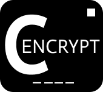

# **C-ENCRYPT**

C-ENCRYPT est un programme codé en language C permettant de <strong>chiffrer</strong> et de <strong>déchiffrer</strong> des messages. Ce programme utilise le <a href="https://fr.wikipedia.org/wiki/Chiffrement_par_d%C3%A9calage">chiffre de César</a> ainsi que le <a href="https://fr.wikipedia.org/wiki/Chiffre_de_Vigen%C3%A8re">chiffre de Vigenère</a> que l'utilisateur pourra choisir selon ses préférences.

---

<!-- à compléter  -->

**Développeurs** :
* *Amdjad Anrifou*
* *Fabio Bentaila*
* *Wiktor Kopec*
* *Thomas daure*