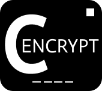
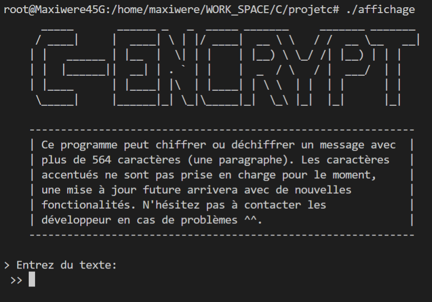
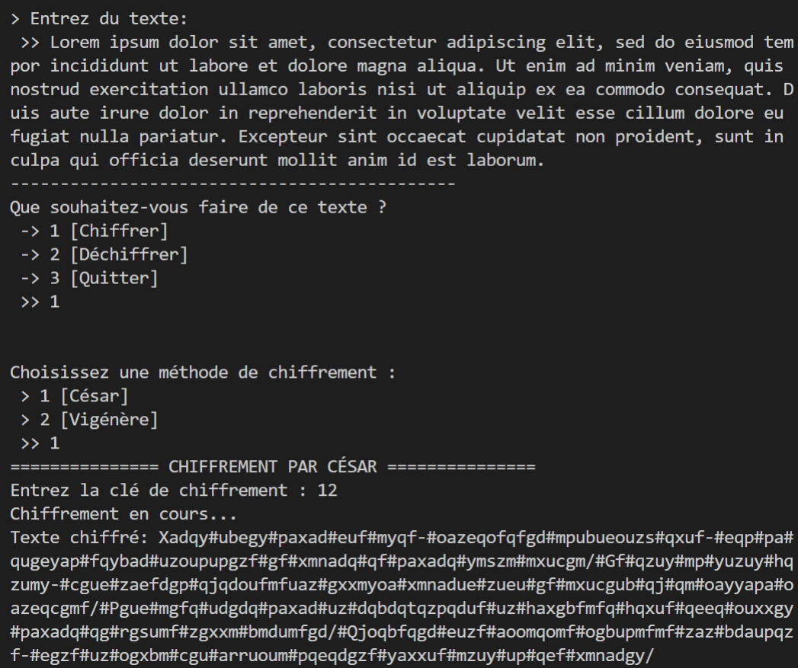
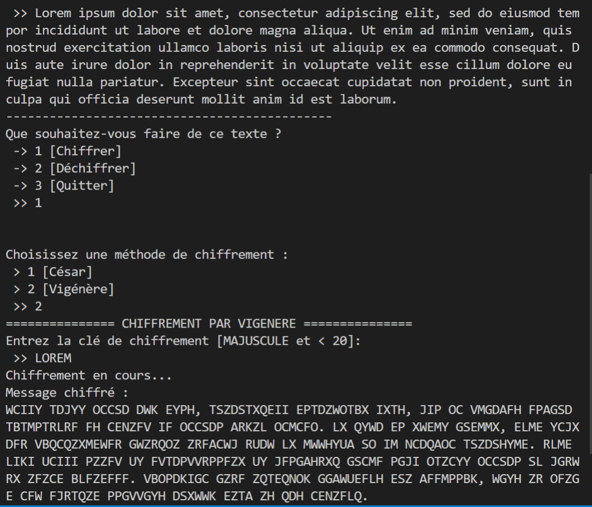
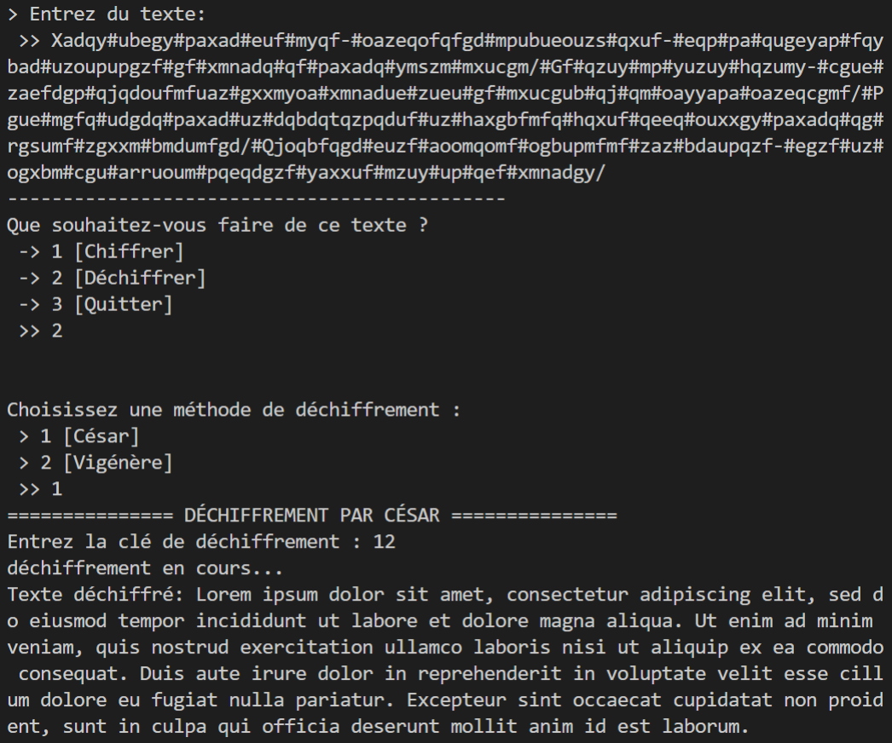
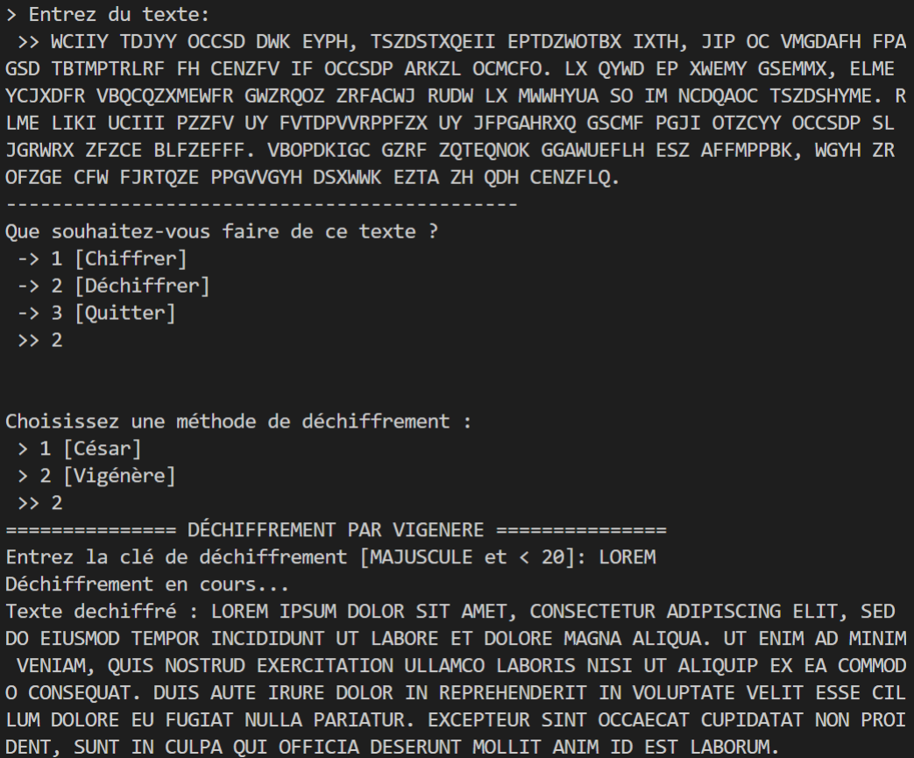
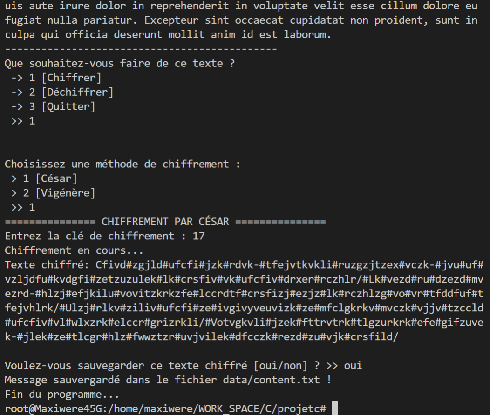
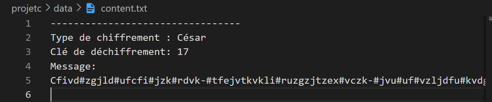

# **C-ENCRYPT**

C-ENCRYPT est un programme codé en language C permettant de <strong>chiffrer</strong> et de <strong>déchiffrer</strong> des messages. Ce programme utilise le <a href="https://fr.wikipedia.org/wiki/Chiffrement_par_d%C3%A9calage">chiffre de César</a> ainsi que le <a href="https://fr.wikipedia.org/wiki/Chiffre_de_Vigen%C3%A8re">chiffre de Vigenère</a> que l'utilisateur pourra choisir selon ses préférences. Une nouvelle méthode de chiffrement arrivera bientôt ^^.

* **<a href="https://github.com/Maxiwere45/projetc">Lien vers le dépot gît</a>**

 

# Sommaire

* **[Sommaire](#sommaire)**
* **[Installation](#installation)**
* **[Tests](#tests)**
	* [Chiffrement par César](#chiffrement-par-césar)
    * [Chiffrement par Vigénère](#chiffrement-par-vigénère)
    * [Déchiffrement par César](#déchiffrement-par-césar)
    * [Déchiffrement par Vigénère](#déchiffrement-par-vigénère)
    * [Sauvegarde dans un fichier](#sauvegarde-dans-un-fichier)
* **[Crédits](#crédits)**

 

# Installation

Avant toute chose, assurez-vous d'avoir installé le compilateur `gcc` ou `MinGW` sur votre machine.
* <a href="https://winlibs.com">Cliquer ici pour obtenir gcc et MinGW</a>

### **Étape 1**
Téléchargez le fichier *.zip* et decompressez-le dans un dossier de votre choix

### **Étape 2**
* *Windows*
    1. Lancez `powershell` ou `cmd`
    2. Positionnez-vous dans le dossier cible avec la commande `cd`
    3. Éxécuter la commande `make all`
    4. Éxécuter la commande `./affichage`

* *Linux*
    1. Lancez le `Terminal UNIX`
    2. Positionnez-vous dans le dossier cible avec la commande `cd`
    3. Éxécuter la commande `make all`
    4. Éxécuter la commande `./affichage`

# Tests

### Affichage du programme

 

### Chiffrement par César

 

### Chiffrement par Vigénère

 

### Déchiffrement par César

 

### Déchiffrement par Vigénère

 

### Sauvegarde dans un fichier

 

 

# Crédits

Ce programme a été réalisé par des étudiants de l'**IUT informatique de Toulouse** dans le cadre d'un mini projet de groupe en programmation C. Pour en savoir un peu plus, vous pouvez contactez les développeurs du programme 
* [**Amdjad Anrifou**](https://github.com/maxiwere45)
* [**Fabio Bentaila**](https://github.com/Fujitoo)
* [**Wiktor Kopec**](https://github.com/WIKPAK)
* [**Thomas Daure**](https://github.com/Cheloo01)

